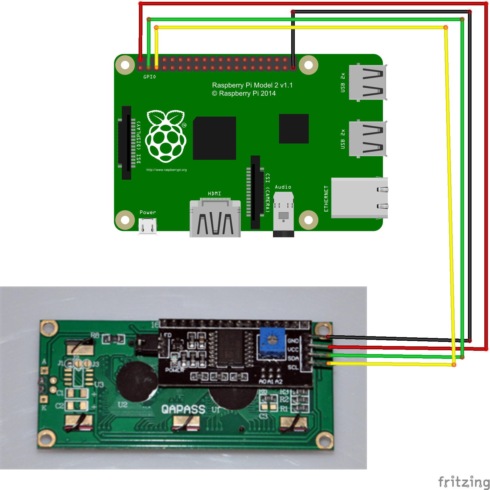

# busboard-raspberry
An application to fetch realtime bus departures information and display them on a 20x4 LCD
screen connected to a Raspberry via the i2c interface.

Click on the image below to see a video:
[](https://youtu.be/_5oT6uOLVwk) 

## Instructions
Clone this repo in your Raspberry:
```shell script
https://github.com/amcarvalho/busboard-raspberry
```

Install requirements (it's a good idea to do this within a virtual environment):
```shell script
pip install -r requirements.txt
```

Define the following environment variables:
```shell script
export TRANSPORT_API_APP_ID=<transport_api_app_id>
export TRANSPORT_API_APP_KEY=<transport_api_app_key>
export TRANSPORT_API_BUS_STOP=<bus stop ATCO code> # Example: 490009931N

# Optional
TRANSPORT_API_HOURS_WITHOUT_UPDATES=<comma separated hours> # Default: 20,21,22,23,00,01,02,03,04,05,06,07
```

Run application:
```shell script
python main.py
```

* You can get a Transport API app ID and Secret [here](https://developer.transportapi.com/).
* You can use OpenStreeMap to get the ATCO code of a bus stop near. Instructions 
[here](https://developer.transportapi.com/docs?raml=https://transportapi.com/v3/raml/transportapi.raml##bus_information).
Use the Bus Information dropdown for alternative ways to get ATCO codes.

## Implementation Details
* Each line on the board is split into 4 columns: order (next bus arriving), route, direction/destination
and ETA at the bus stop. All columns are fixed in length, including the direction/destination. If
the direction/destination length exceeds the available number of characters, the application will
horizontally scroll it

* By default, the application only makes Transport API calls between 8am and 8pm. If allowed
to make calls during all hours of the day, the free 30k/month calls wouldn't be enough. You may
adjust the hours by setting the environment `TRANSPORT_API_HOURS_WITHOUT_UPDATES` variable

* The screen is refreshed every 0.3s in order to horizontally scroll the direction/destination
column

* After every 105 screen refresh iterations, a new call to the transport API is made. This will
make sure a new call is made every 40/60s. In combination with the `TRANSPORT_API_HOURS_WITHOUT_UPDATES`
this makes sure no more than 30k call are made on a month

* I've used [this](https://www.amazon.co.uk/gp/product/B07QNKCLJM/ref=ppx_yo_dt_b_asin_title_o01_s01?ie=UTF8&psc=1)
LCD, but I'm sure any other similar 20x4 LCD with an i2c interface will work

* Below is an illustration of how to connect your LCD to your RaspberryPi GPIO. This image was
downloaded from [osoyoo.com](https://osoyoo.com/2016/06/01/drive-i2c-lcd-screen-with-raspberry-pi/)
